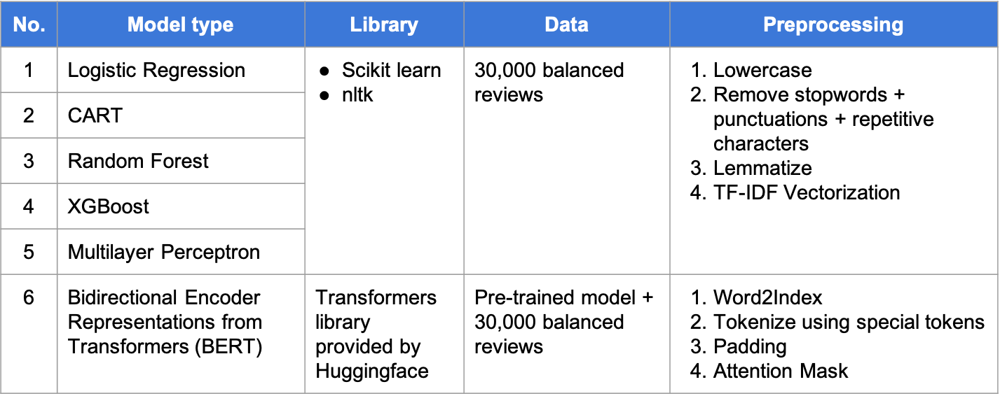
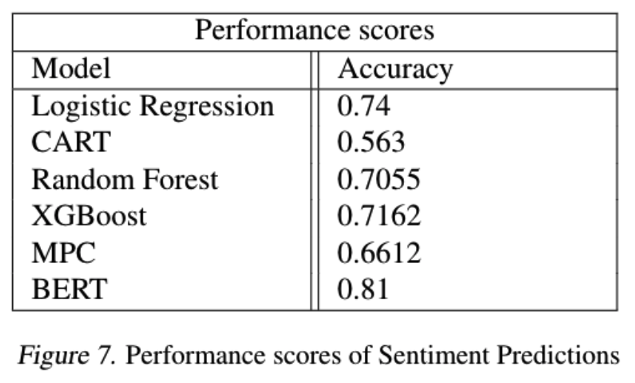
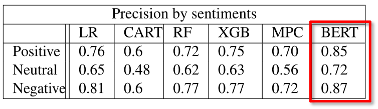
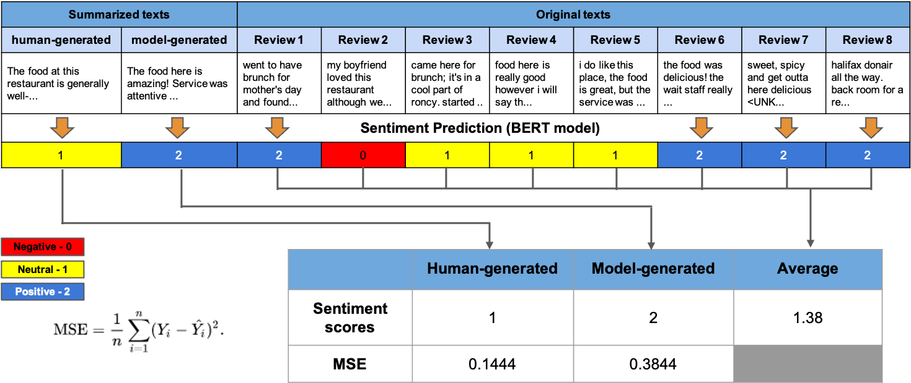
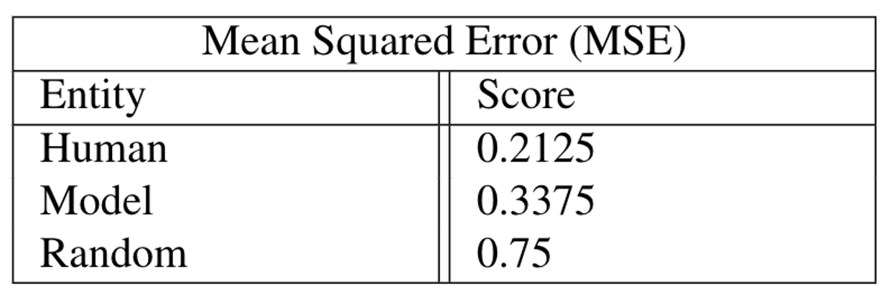

## Text Summarization and Sentiment Analysis

### Team:
* Boyu Liu
* ByeongJo Kong

### Dataset:
Yelp dataset available on Kaggle
https://www.kaggle.com/yelp-dataset/yelp-dataset

* 5,200,000 user reviews
* Information on 174,000 businesses
* The data spans 11 metropolitan areas

### Problem:
With an overwhelming number of user reviews being generated on various online platforms, e.g. YELP, there is an increasing movement towards using NLP techniques to extract meaninful information from the review data; one of which is Text Summarization technique. However, can we fully trust the ML model to correctly transfer the sentiments from the original text to the summarized text? Is there any risk of distortion of original sentiments?

### Goal:
Our goal in this project is to examine the changes in sentiment information which may occur during the text summarization process.

### ML algorithms:
* TF-IDF
* Logistic Regression
* CART
* Random Forest
* XGBOOST
* Multilayer Perceptron Classifier
* Bidirectional Encoder Representations from Transformers (BERT)
* Pegasus (Text summarization)

### Sentiment Analysis

**Performance comparison**

<!-- <table>
  <tr align='center' bgcolor='grey' style="font-weight:bold">
    <td>No.</td>
    <td style="width:140px">Model</td>
    <td>Library</td>
    <td>Data</td>
    <td>Preprocessing</td>
  </tr>
  <tr>
    <td align='center'>1</td>
    <td>Logistic Regression</td>
    <td rowspan='5'>Scikit learn, nltk</td>
    <td rowspan='5'>30,000 balanced reviews</td>
    <td rowspan='5'>
    <ol>
    <li>Convert to lowercase</li>
    <li>Remove stopwords + punctuations + repetitive characters</li>
    <li>Lemmatize</li>
    <li>TF-IDF vectorization</li>
    </td>
  </tr>
  <tr align='center'>
    <td>2</td>
    <td>CART</td>
  </tr>
  <tr align='center'>
    <td>3</td>
    <td>Random Forest</td>
  </tr>
  <tr align='center'>
    <td>4</td>
    <td>XGBoost</td>
  </tr>
  <tr align='center'>
    <td>5</td>
    <td>Multilayer Perceptron</td>
  </tr>
  <tr>
    <td align='center'>6</td>
    <td align='center'>BERT</td>
    <td>Transformers (Huggingface)</td>
    <td>Pretrained model (Huggingface) + 30,000 balanced reviews</td>
    <td>
    <ol>
    <li>Word2Index</li>
    <li>Tokenize using BERT-required special tokens</li>
    <li>Padding</li>
    <li>Attention mask</li>
    </ol>
    </td>
  </tr>
</table> -->

**Results - Performance scores**

**Text Summarization Model Evaluation**

**Evaluation Results**

