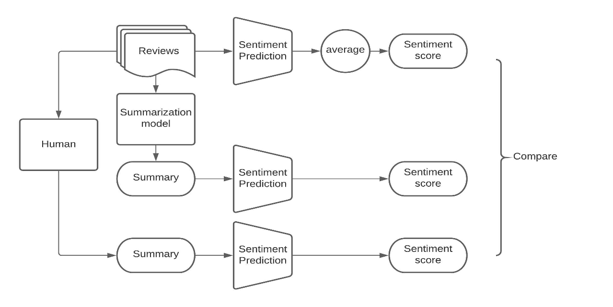

## Evaluating Sentiment Capturing of Text Summarization Models

### Dataset:
Yelp dataset available on Kaggle
https://www.kaggle.com/yelp-dataset/yelp-dataset

* 5,200,000 user reviews
* Information on 174,000 businesses
* The data spans 11 metropolitan areas

### Problem:
With an overwhelming number of user reviews being generated on various online platforms, e.g. YELP, there is an increasing movement towards using NLP techniques to extract meaninful information from the review data; one of which is Text Summarization technique. However, can we fully trust the ML model to correctly transfer the sentiments from the original text to the summarized text? Is there any risk of distortion of original sentiments?

### Goal:
Our goal in this project is to examine the changes in sentiment information which may occur during the text summarization process.

### ML algorithms:
* TF-IDF
* Logistic Regression
* CART
* Random Forest
* XGBOOST
* Multilayer Perceptron Classifier
* Bidirectional Encoder Representations from Transformers (BERT)
* Pegasus (Text summarization)

### Methods:

 

### Sentiment Analysis:

**Comparative Analysis of 6 ML models**

 

**Performance scores**

 

**Conclusion**
* BERT, a contextual language model, outperformed other models by a large margin

### Text Summarization:
Based on the reviews of 70 businesses with human-generated summaries for benchmark analysis

**Model Evaluation**

**Evaluation Results**

 

**Conclusion**
* Compared to the baseline (randomly generated sentiments), the ML algorithm does a good job overall in capturing the original sentiments
* However, there is still room for improvement compared to the human-generated summaries

